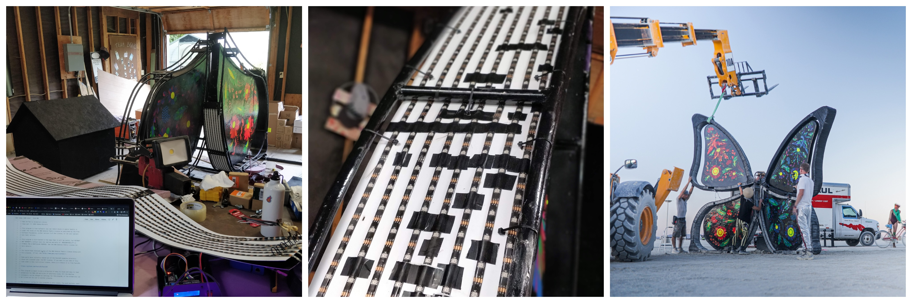

*I had zero knowledge about the Arduino and programmable LEDs before this project and had to spend tons of time looking for the information. For anyone who'll decide to start a similar project I've structured project and README to be a starting point.* 

*Have fun and build sth awesome 🦋*

## What is Catharsis

[Catharsis](http://mycatharsis.art/) is an installation built in the shape of a butterfly painted in traditional Ukrainian Petrykivka style at [Burning Man 2019](https://burningman.org/network/about-us/). The edge of the installation was covered with the LED panel to make installation interactive at night.

The repository contains the software to run animations and control LED panel.

## Tech Stack

**LEDs:** [WS2815](https://www.btf-lighting.com/products/1-ws2815-dc12v-led-pixels-strip-light-dual-signal) 12V LED pixels strip, dual-signal

**Controller:** [Teensy 3.2](https://www.pjrc.com/store/teensy32.html), Arduino based board + [OctoWS Adaptor](https://www.pjrc.com/store/octo28_adaptor.html)

**Library:** [FastLED](http://fastled.io/)

**Dev Environment:** VS Code + [Platform IO](https://platformio.org/) plugin

## Power Calculation

We had 8 parallel lines of LEDs, each ~17m long, **140m of LED strip or 4200 pixels in total**.

LED strip consumes 9W per meter of strip ⇒ **1260W (or 105A) peak load**.

## Result

*Timelapse from the last test before heading to the desert (c) @ozasadnyy.*

## Q&A

**Why WS2815 LEDs?**

WS2815 are more expensive, but comparing to the most popular WS2812 version: 

- They are 12V, which allowed reducing the current in the system from crazy 300A to manageable 105A
- WS2815 has backup data line, which means when one LED dies, the rest of the strip keeps working. In WS2812 - all LEDs after the broken one will stop working.

**Why Teensy?**

Teensy is excellent for LED projects, mainly because of [OctoWS Adaptor](https://www.pjrc.com/store/octo28_adaptor.html) that allows parallelizing data output. It is powerful enough to control up to 5000 LEDs on 60 FPS. 

**Why FastLED?**

FastLED has tons of examples, the great community around, and it works great with OctoWS Adaptor library.

**Why VS Code and Platform IO?**

I've tried default Arduino IDE; it works, and it is simple... too simple. If you're a software engineer, you'll feel yourself like in the notepad.

VS Code is a full-featured IDE,  with a combination of Platform IO plugin allow embedded development in a few clicks. I've also tried the official [Arduino plugin from Microsoft](https://marketplace.visualstudio.com/items?itemName=vsciot-vscode.vscode-arduino), but it doesn't support Teensy board because of the custom loader.

## Credits

[@vzasadnyyy](http://github.com/zasadnyy) LED panel prototype, controller hardware assemble and software architecture.

[@ozasadnyy](http://github.com/ozasadnyy) Animations and final software.

[@eolexe](http://github.com/eolexe) Invaluable help to build the final 17m long LED panel.

## License

The project is published under the [MIT License](LICENSE). Feel free to copy, distribute, use for commercial purposes; just keep the authors in credits.
